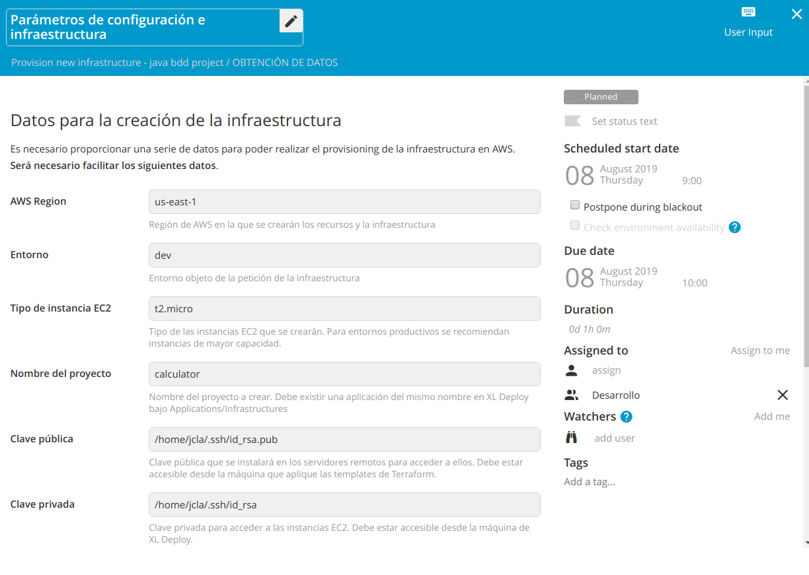
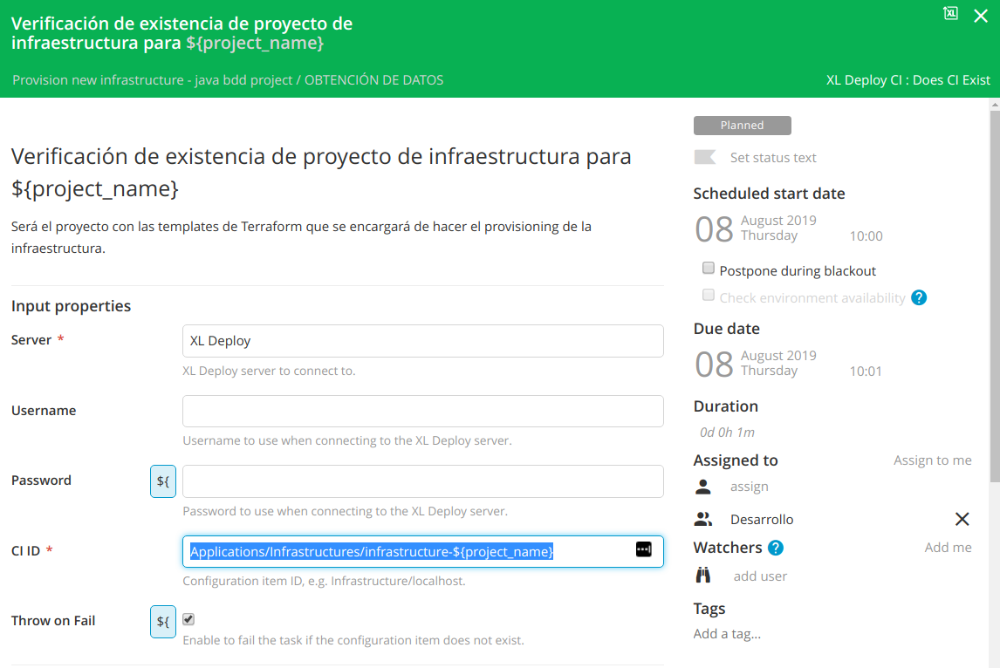
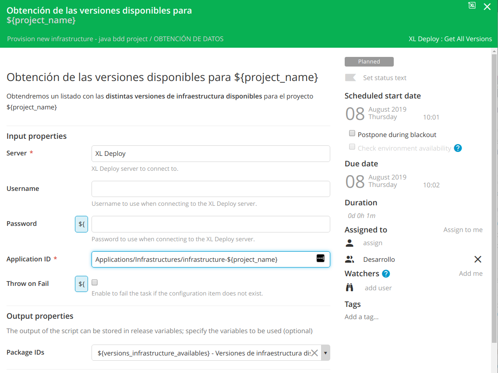
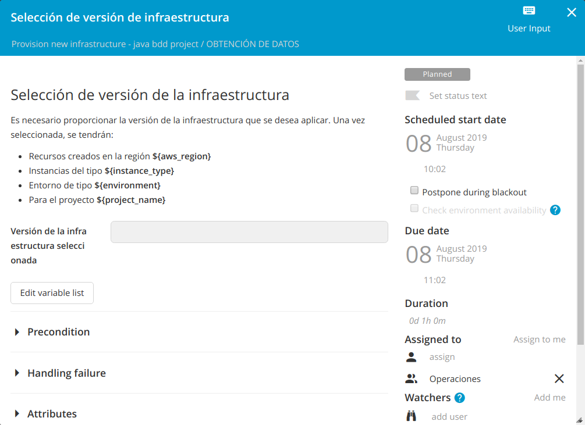

# ¿Dónde recoger los parámetros?
Vamos a empezar a diseñar nuestra 'template' en XL Release.

El primer paso será recoger los parámetros que vamos a utilizar para crear nuestra infraestructura. Nombre del proyecto, entorno, región de AWS, tamaño de las instancias EC2, las claves pública y privada que vamos a utilizar para acceder a ellas, etc.

Esta será nuestra primera fase en XL Release.

## Obtención de datos

Vamos a crear una primera fase en XL Release en la que vamos a recoger los parámetros con los que invocaremos a nuestras templates de Terraform.

### Paso 1: Parámetros de configuración e infraestructura (User Input)
Definimos las siguientes variables en nuestra template de XL Release:
* aws_region
* environment
* instance_type
* project_name
* public_key_path
* private_key_path

Algunas de ellas como 'environment', 'aws_region' o 'instance_type' pueden ser de tipo 'List box' y con valores fijos.

La template de Terraform se lanzará desde una máquina que tendrá que tener acceso a la public_key_path para que pueda instalarla en las máquinas EC2 que se van a crear.

### Paso 2: Verificación de existencia de proyecto de infraestructura para ${project_name} (XL Deploy CI: Does CI Exist)
*Para definir este step, es necesario crear un servidor XL Deploy bajo 'Settings -> Shared configuration' o bajo la pestaña 'Configuration' dentro de la carpeta en la que se ubique la template.*

En este paso nos aseguramos de que existe un proyecto de infraestructura creado en XL Deploy para nuestra aplicación/proyecto. Para ello verificamos que existe un CI cuyo ID sea `Applications/Infrastructures/infrastructure-${project_name}`.

Será el proyecto con las templates de Terraform que se encargará de hacer el provisioning  de la infraestructura.

Si no existe, detenemos el pipeline. Para ello marcamos `Throw on Fai` a true.

Una mejora sería obtener automáticamente las aplicaciones disponibles bajo la carpeta `Applications/Infrastructures` y presentarlas en un 'List box'.

### Paso 3: Obtención de las versiones disponibles para ${project_name} (XL Deploy: Get All Versions)
Aquí seleccionamos la versión de las templates de Terraform que queremos utilizar para crear nuestra infraestructura.

Obtendremos un listado con las **distintas versiones de infraestructura disponibles** para el proyecto ${project_name}. El resultado lo almacenamos en una variable de tipo 'List'.

### Paso 4: Selección de versión de infraestructura (User Input)
Aquí seleccionamos una de las versiones de infraestructura disponibles para el proyecto seleccionado.

La selección del usuario la almacenamos en la variable `${version_infrastructure_selected}`