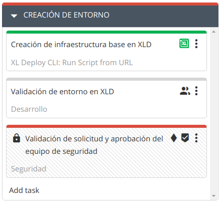
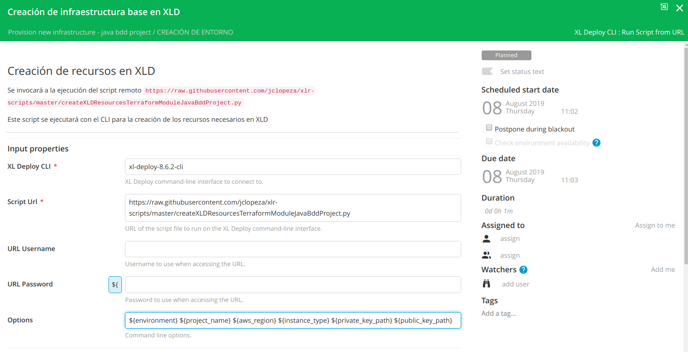
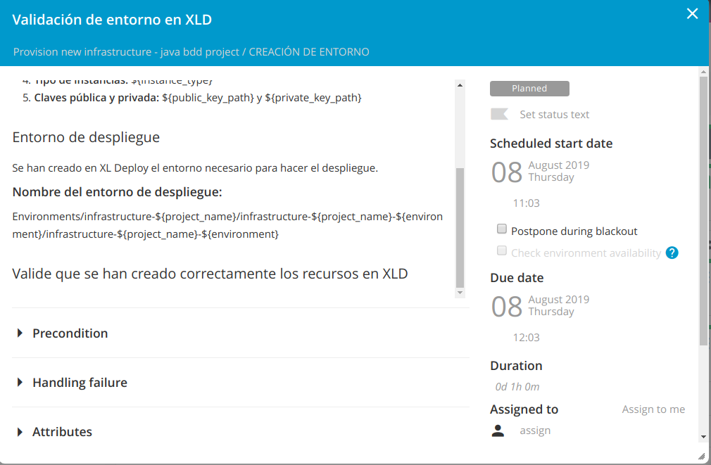
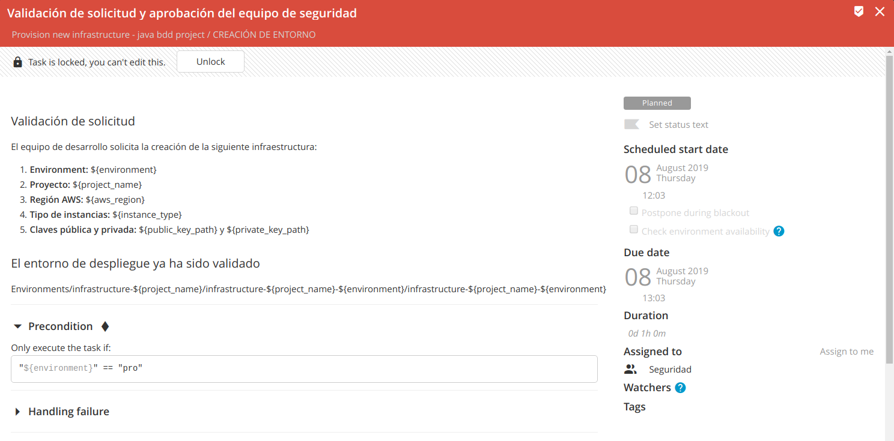

# ¿Cómo y desde dónde ejecuto las templates de Terraform?
¿Cómo y desde dónde ejecuto las templates de Terraform pasando los parámetros necesarios y con los valores que hemos facilitado?

De esto se va a encargar XL Deploy. Vamos a definir los CIs necesarios para poder hacer el despliegue de esta infraestructura con XL Deploy. Vamos a:
* crear un directorio bajo Infrastructure de nombre Terraform. En este directorio daremos de alta los hosts que harán las ejecuciones de las templates invocando al comando `terraform apply ...`.
* definir la máquina desde la que se ejecutarán las templates de Terraform (esa máquina tendrá que tener acceso a la clave pública que hemos informado en el campo public_key_path)
* asignar cada máquina para provisionar un tipo de entorno determinado. Tendremos un host configurado con las claves AWS necesarias para provisionar los entornos de dev, otro host para provisionar los entornos de pre y otro para los entornos de pro.
* crear un espacio/directorio dentro de esa máquina para ejecutar las templates de Terraform del proyecto. Es ahí donde se guardará el Terraform state. Será el 'workingDirectory'.
* crear un directorio bajo 'Environments' para el proyecto de nombre infrastructure-project y un nuevo 'environment'
* crear un diccionario con los valores de los parámetros
* asociar el cliente de Terraform y el diccionario al entorno creado.

Esta será nuestra segunda fase en XL Release.

## Creación de entorno

Vamos a crear una segunda fase en XL Release en la que vamos a crear los CIs necesarios en XL Deploy para poder desplegar nuestra infraestructura con un cliente de Terraform.



### Paso 1: Creación de infraestructura base en XLD (XL Deploy CLI: Run Script from URL)
*Para definir este step, es necesario crear un servidor XL Deploy CLI bajo 'Settings -> Shared configuration' o bajo la pestaña 'Configuration' dentro de la carpeta en la que se ubique la template.*

Se invocará a la ejecución del script remoto `https://raw.githubusercontent.com/jclopeza/xlr-scripts/master/createXLDResourcesTerraformModuleJavaBddProject.py`

Este script se ejecutará con el CLI para la creación de los recursos necesarios en XLD.

Se pasarán las siguientes variables en el campo `options`:
```
${environment} ${project_name} ${aws_region} ${instance_type} ${private_key_path} ${public_key_path}
```



### Paso 2: Validación de entorno en XLD  (Manual)
Incluímos un paso para que se verifique que se ha creado el entorno de forma correcta en XL Deploy. Esta validación también se podría haber hecho de forma automática.

`Environments/infrastructure-${project_name}/infrastructure-${project_name}-${environment}/infrastructure-${project_name}-${environment}`



### Paso 3: Validación de solicitud y aprobación del equipo de seguridad (Gate)
Incluímos una validación adicional que sólo tendrá lugar si el entorno seleccionado es el de producción.

