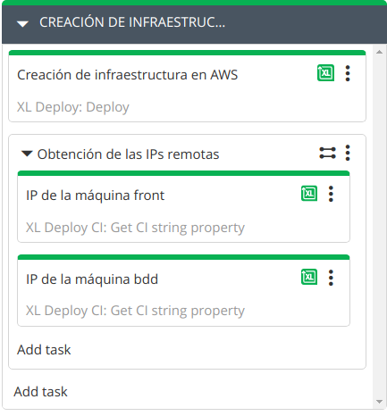
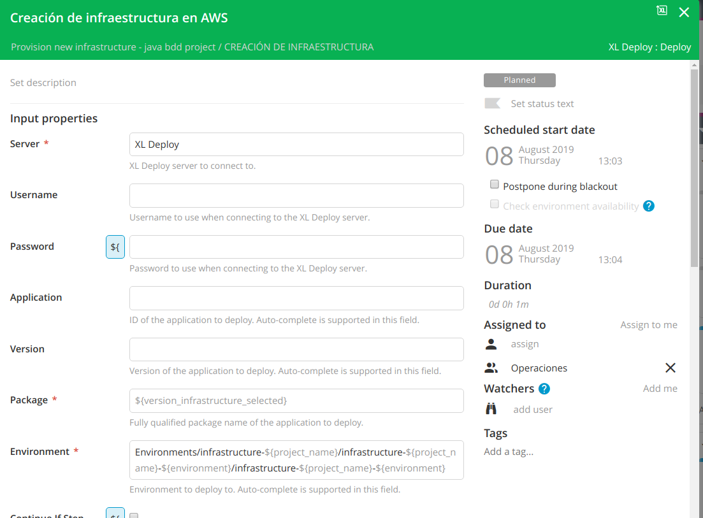
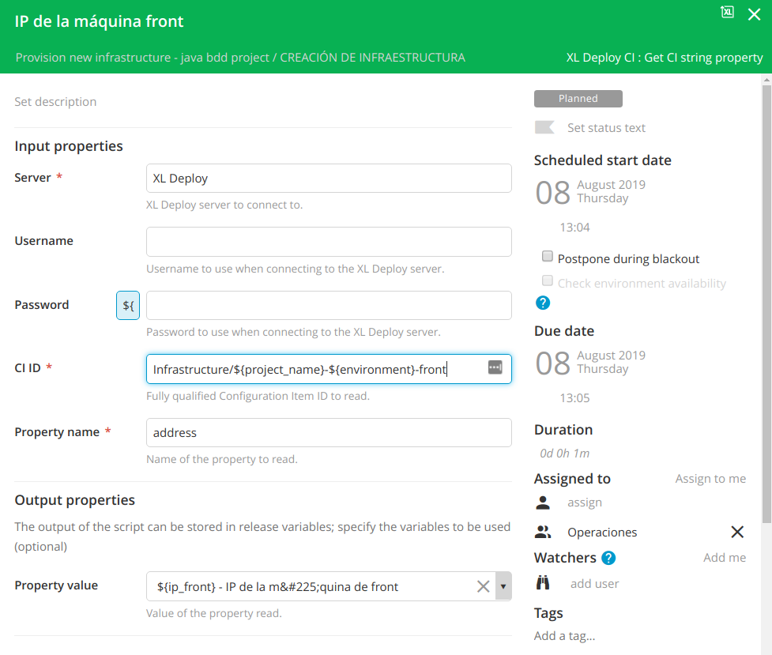

# ¿Cómo inicio la ejecución?
¿Cómo inicio la ejecución de las templates de Terraform?

Ya tenemos todo lo necesario para iniciar este despliegue. Tenemos el Deployment Package en XL Deploy y el 'environment' que acabamos de crear de forma dinámica (configurado con un cliente de Terraform y un diccionario con todos los parámetros que se tienen que aplicar).

Esta será nuestra tercera fase en XL Release.

## Creación de infraestructura

Vamos a crear una tercera fase en XL Release en la que vamos a lanzar la ejecución de las templates.

### Paso 1: Creación de infraestructura en AWS (XL Deploy: Deploy)
Se trata de indicar qué queremos desplegar y dónde, es decir, facilitar el Deployment Package y el entorno de destino o environment.
Este script se ejecutará con el CLI para la creación de los recursos necesarios en XLD.

* En `package` tendremos que indicar la versión que queremos desplegar: `${version_infrastructure_selected}` (depende del nombre de la variable que hayamos definido)
* En `environment` el entorno que hemos creado dinámicamente en el paso anterior: `Environments/infrastructure-${project_name}/infrastructure-${project_name}-${environment}/infrastructure-${project_name}-${environment}`

### Paso 2: Obtención de las IPs remotas (XL Deploy CI: Get CI string property)
Cuando se crea la infraestructura con XL Deploy y Terraform, se crean y registran también dos CIs del tipo overthere.SshHost de forma automática en XL Deploy con la información necesaria para acceder a las nuevas instancias EC2 creadas. Esto es, la dirección IP, sistema operativo, usuario y la ubicación de la clave privada para acceder a ellas.

*La clave privada que se facilita como parámetro en la primera fase de XL Release, debe ser accesible desde el servidor en el que se ejecute XL Deploy.*

Con esta tarea, lo que vamos es a recuperar esas direcciones IP para luego poder hacer el provisioning de esas dos instancias EC2.

Sabemos el nombre que van a tener los hosts en XL Deploy (el nombre lo indicamos en las templates), por tanto es muy fácil acceder a los atributos de los mismos.

Nombre de los CI:
* Infrastructure/${project_name}-${environment}-front
* Infrastructure/${project_name}-${environment}-bdd

Property name:
* address *(en ambos casos)*

