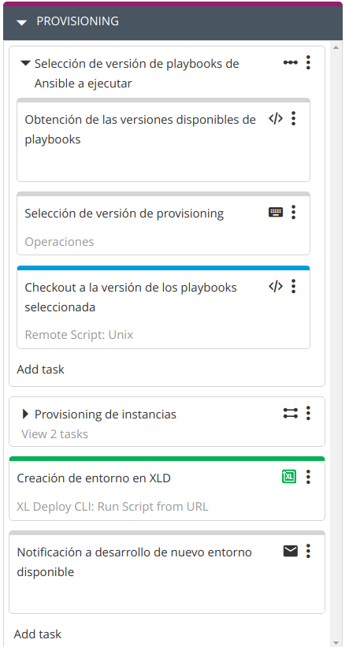
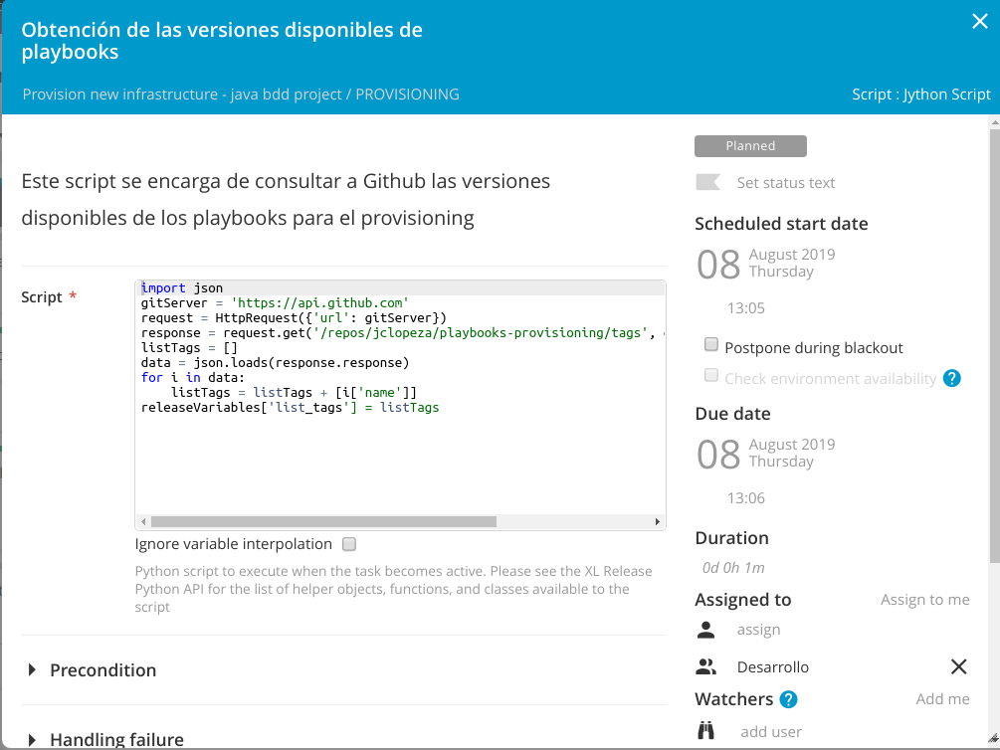
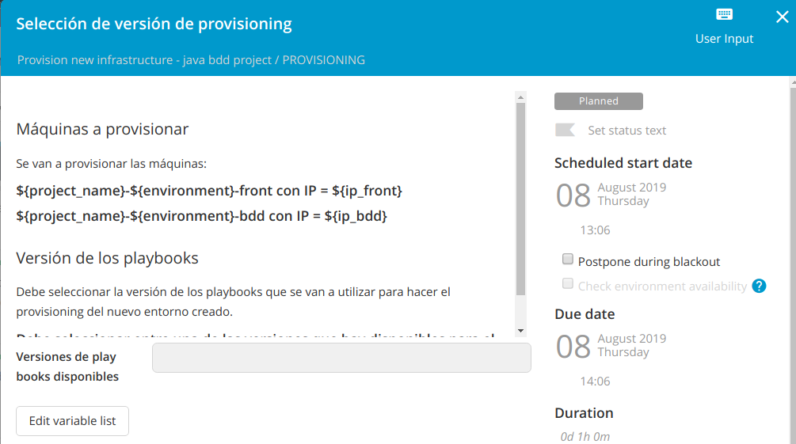
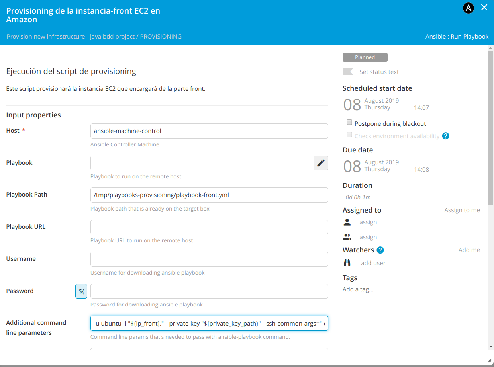
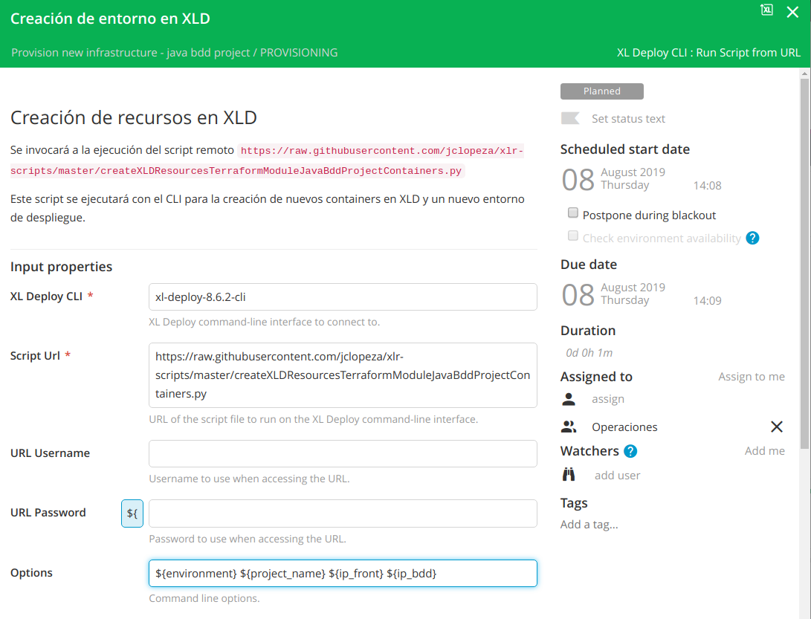
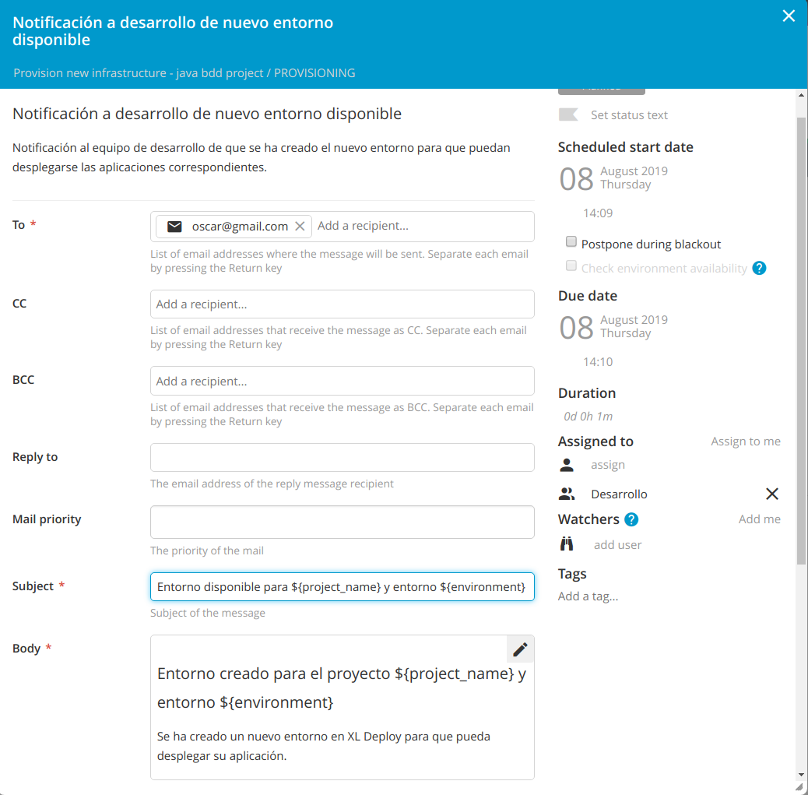

# ¿Cómo provisiono la nueva infraestructura creada?
Tenemos creada nuestra infraestructura en Amazon (dos instancias EC2) y hemos creado dos nuevas máquinas en XL Deploy con las direcciones IP y demás información necesaria para acceder a ellas.

Ahora queremos instalar el middleware necesario en estas máquinas para poder ejecutar nuestras aplicaciones (tomcat, mysql-server, etc.).

Sería deseable que los playbooks de Ansible que se utilizasen para el provisioning, estuviesen versionados y que tuviésemos la oportunidad de seleccionar qué versión de los playbooks es la que queremos utilizar para instalar el middleware en nuestras instancias EC2.

Esta será nuestra cuarta fase en XL Release.

## Provisioning

Vamos a crear una cuarta fase en XL Release en la que vamos a provisionar nuestras instancias EC2 recién creadas.



### Paso 1: Obtención de las versiones disponibles de playbooks (Script: Jython Script)
En el siguiente repositorio Git, tenemos los playbooks de Ansible con los distintos roles que se necesitan para provisionar las nuevas instancias EC2 `https://github.com/jclopeza/playbooks-provisioning`

En este repositorio hay varias versiones disponibles. El primer paso será obtener todas las versiones disponibles. Lo conseguimos con el siguiente código:
```
import json
gitServer = 'https://api.github.com'
request = HttpRequest({'url': gitServer})
response = request.get('/repos/jclopeza/playbooks-provisioning/tags', contentType='application/json')
listTags = []
data = json.loads(response.response)
for i in data:
    listTags = listTags + [i['name']]
releaseVariables['list_tags'] = listTags
```



### Paso 2: Selección de versión de provisioning (User Input)
En este paso se muestran todas las versiones existentes en el repositorio Git para que el usuario seleccione cuál desea utilizar para provisionar las instancias EC2.

Las versiones se obtuvieron en el paso anterior.



La selección la almacenamos en la variable `${tag_ansible_selected}`

### Paso 3: Checkout a la versión de los playbooks seleccionada (Remote Script: Unix)
En este paso clonamos el repositorio Git con los playbooks de Ansible y hacemos checkout a la versión previamente seleccionada.
```
cd /tmp && rm -fr playbooks-provisioning
git clone https://github.com/jclopeza/playbooks-provisioning.git
cd playbooks-provisioning
git checkout ${tag_ansible_selected}
```


### Paso 4: Provisioning de la instancia-front/bdd EC2 en Amazon (Ansible: Run Playbook)


*Para definir este step, es necesario crear un servidor de tipo Unix Host remoto que será desde el que se ejecuten los playbooks, sería la máquina de control de Ansible. Bajo 'Settings -> Shared configuration' o bajo la pestaña 'Configuration' dentro de la carpeta en la que se ubique la template se debe crear un Unix Host.*

Tenemos los playbooks en el directorio `/tmp/playbooks-provisioning`. Tenemos que provisionar la instancia 'front' y la instancia 'bdd'. Habrá que ejecutar para la parte front:
* Playbook Path: `/tmp/playbooks-provisioning/playbook-front.yml`
* Additional command line parameters: `-u ubuntu -i "${ip_front}," --private-key "${private_key_path}" --ssh-common-args="-o StrictHostKeyChecking=no" -e "public_key_path=${public_key_path}"`

Y para la parte bdd:
* Playbook Path: `/tmp/playbooks-provisioning/playbook-bdd.yml`
* Additional command line parameters: `-u ubuntu -i "${ip_bdd}," --private-key "${private_key_path}" --ssh-common-args="-o StrictHostKeyChecking=no"`



### Paso 5: Creación de entorno en XLD (XL Deploy CLI: Run Script from URL)
Ya tenemos nuestras instancias EC2 con todo el middleware instalado. Ahora vamos a informar a XL Deploy de este nuevo middleware para que podamos ser capaces de desplegar nuevas aplicaciones en él.

Se ejecutará:
* el script: `https://raw.githubusercontent.com/jclopeza/xlr-scripts/master/createXLDResourcesTerraformModuleJavaBddProjectContainers.py`
* con las opciones: `${environment} ${project_name} ${ip_front} ${ip_bdd}`

Esto creará nuevos containers bajo los hosts creados en XL Deploy:
* axis2.Deployer
* tomcat.Server
* tomcat.VirtualHost
* smoketest.Runner
* sql.MySqlClient

Creará un nuevo diccionario:
* ip_front
* ip_bdd

Creará un nuevo entorno con los containers y el diccionario asociado.



### Paso 6: Notificación a desarrollo de nuevo entorno disponible (Notification)
Notificación al equipo de desarrollo de que se ha creado el nuevo entorno para que puedan desplegarse las aplicaciones correspondientes.

