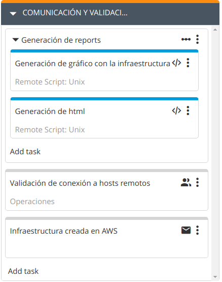
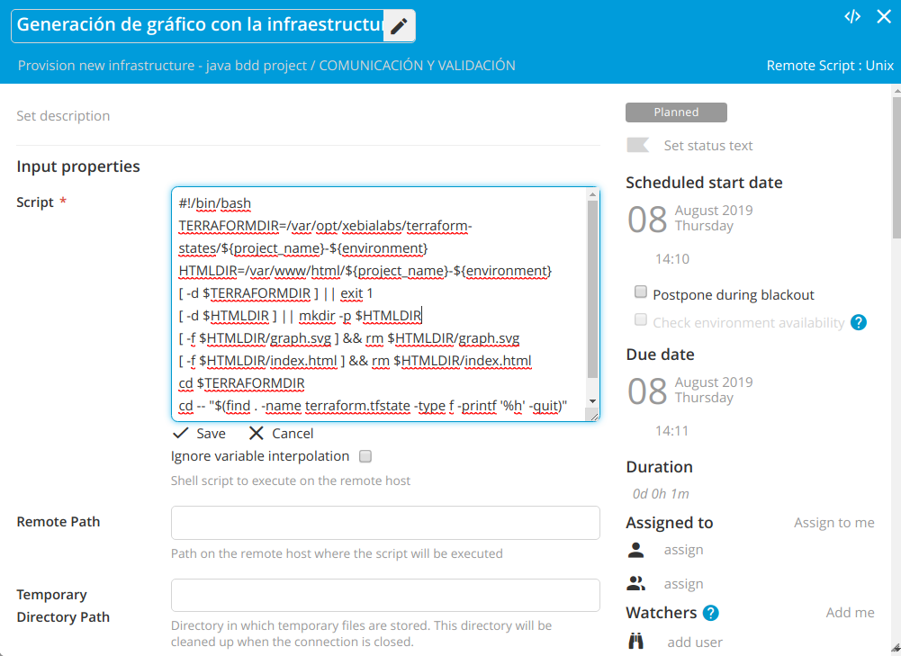
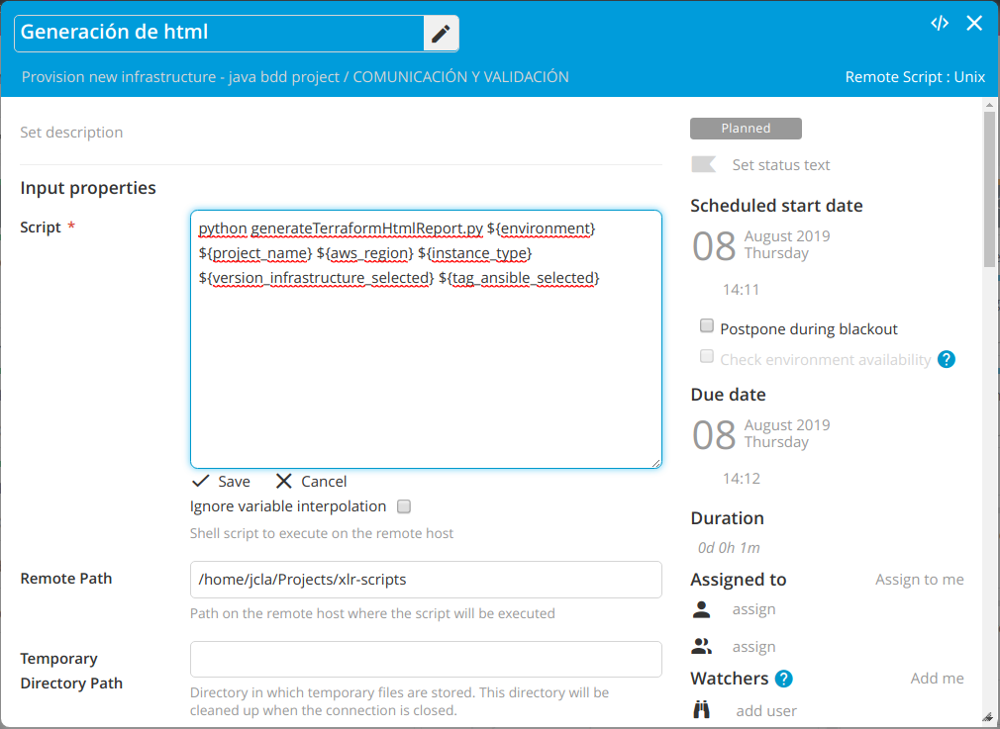
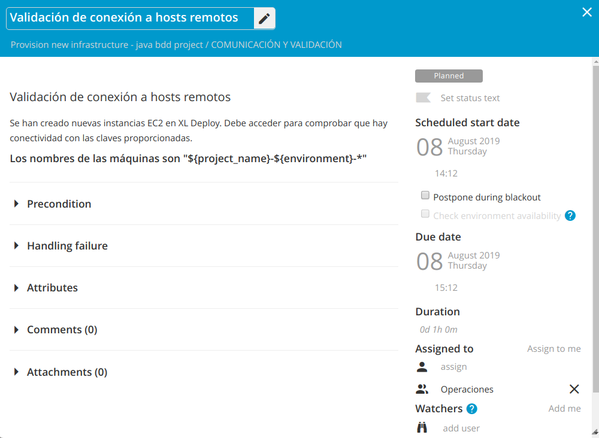
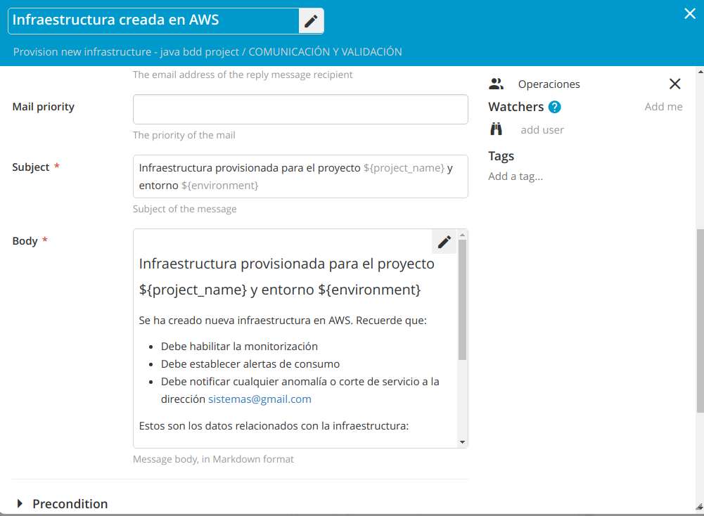

# ¿Cómo notificamos la nueva infraestructura creada?
Tenemos nuestra infraestructura creada en Amazon y ahora quiero notificar la disponibilidad de la misma, generar gráficos, indicar las versiones de las templates de Terraform con la que se ha generados y la versión de los playbooks de Ansible utilizados, etc.

Esta será nuestra quinta fase en XL Release.

## Comunicación y validación

Vamos a crear una quinta fase en XL Release en la que vamos a generar un informe con la infraestructura creada y vamos a darlo a conocer.



### Paso 1: Generación de gráfico con la infraestructura (Remote Script: Unix)
Vamos a generar un gráfico con la estructura creada. Para ello ejecutamos el siguiente script:
```
#!/bin/bash
TERRAFORMDIR=/var/opt/xebialabs/terraform-states/${project_name}-${environment}
HTMLDIR=/var/www/html/${project_name}-${environment}
[ -d $TERRAFORMDIR ] || exit 1
[ -d $HTMLDIR ] || mkdir -p $HTMLDIR
[ -f $HTMLDIR/graph.svg ] && rm $HTMLDIR/graph.svg
[ -f $HTMLDIR/index.html ] && rm $HTMLDIR/index.html
cd $TERRAFORMDIR
cd -- "$(find . -name terraform.tfstate -type f -printf '%h' -quit)"
terraform graph | dot -Tsvg > $HTMLDIR/graph.svg
```



### Paso 2: Generación de html (Remote Script: Unix)
En este paso vamos a ejecutar un script en Python que se va a encargar de generar un HTML con la información relacionada con la infraestructura.

Ejecutaremos el siguiente script:
```
python generateTerraformHtmlReport.py ${environment} ${project_name} ${aws_region} ${instance_type} ${version_infrastructure_selected} ${tag_ansible_selected}
```



Bajo `Remote Path` tenemos que indicar el directorio en el que se encuentra el script `generateTerraformHtmlReport.py`. Este script está disponible en la siguiente dirección:

`https://raw.githubusercontent.com/jclopeza/xlr-scripts/master/generateTerraformHtmlReport.py`

Se encargará de procesar una template y ubicarla en un directorio accesible por un servidor `Nginx`.

### Paso 3: Validación de conexión a hosts remotos (Manual)
En este paso vamos a validar que podemos establecer conexión a las instancias EC2 creadas en Amazon desde los CIs de infraestructura que se crearon en XL Deploy de tipo overthere.SshHost



### Paso 4: Infraestructura creada en AWS (Notification)
En este último paso, enviaremos un correo electrónico con la información de la infraestructura creada y un enlace al report HTML generado en el paso anterior.

El contenido del mensaje es el siguiente:
```
### Infraestructura provisionada para el proyecto ${project_name} y entorno ${environment}

Se ha creado nueva infraestructura en AWS. Recuerde que:

* Debe habilitar la monitorización
* Debe establecer alertas de consumo
* Debe notificar cualquier anomalía o corte de servicio a la dirección sistemas@gmail.com

Estos son los datos relacionados con la infraestructura:

1. **Environment:** ${environment}
2. **Proyecto:** ${project_name}
3. **Región AWS:** ${aws_region}
4. **Tipo de instancias:** ${instance_type}
5. **Claves pública y privada:** ${public_key_path} y ${private_key_path}

También puedes consultar el [gráfico de la estructura creada](http://localhost/${project_name}-${environment}).
```

